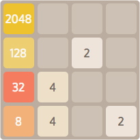
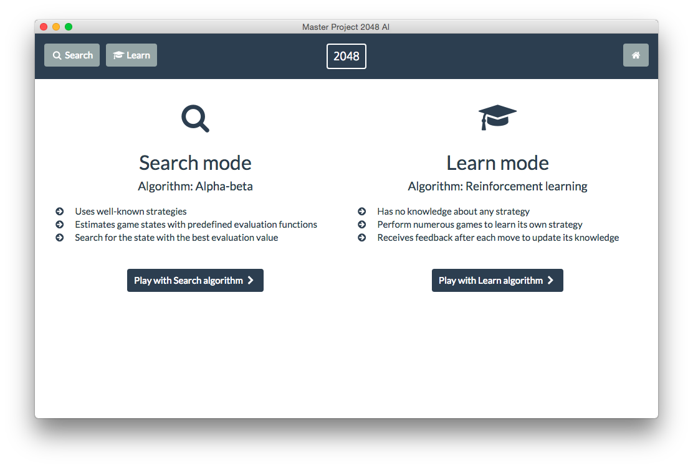

# Master project 2048 AI



## About 

The project aims to maximize winning rate in Game 2048.
To solve the problem it provides two approaches:

- full knowledge of well-known strategies (game tree search algorithm)
- no initial knowledge (reinforcement learning algorithm)

## Installation
The project is release for three main platforms:

- OS X
- Windows
- Linux

Download the proper package from the Release tab.

## Apps

The project consist of two applications:

 - CLI
 - GUI 

### CLI


#### Requirements
 - Node.js
 
#### Install
Run ```npm install```

#### Usage
Run ```./cli.sh```

### GUI



#### Requirements
All requirements are included in zipped package.

#### Usage
Run the executable file (it depends on the platform).
